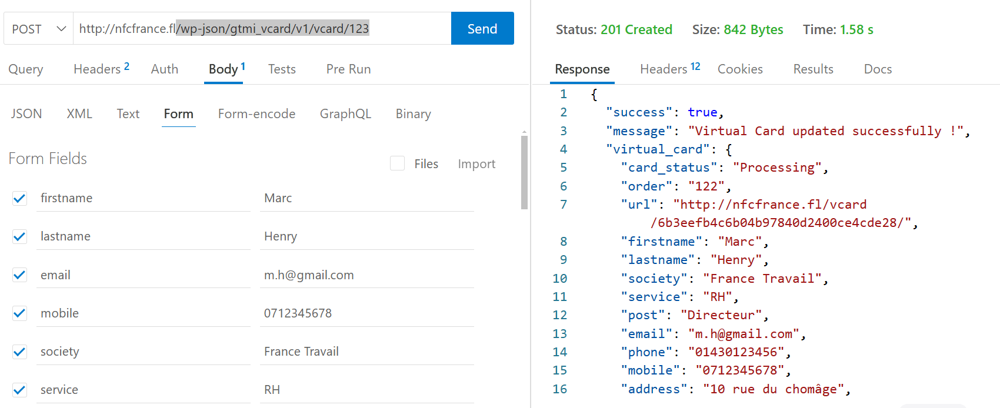
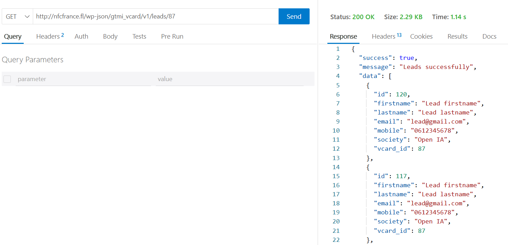
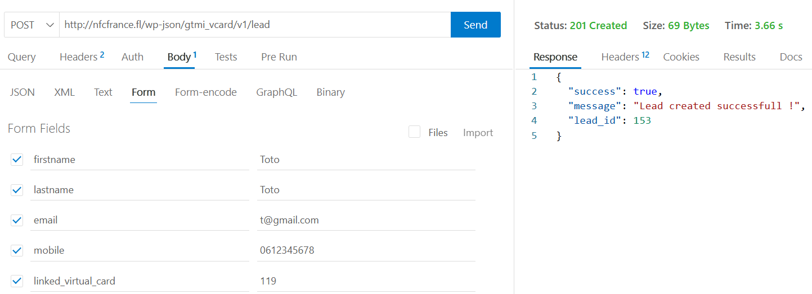
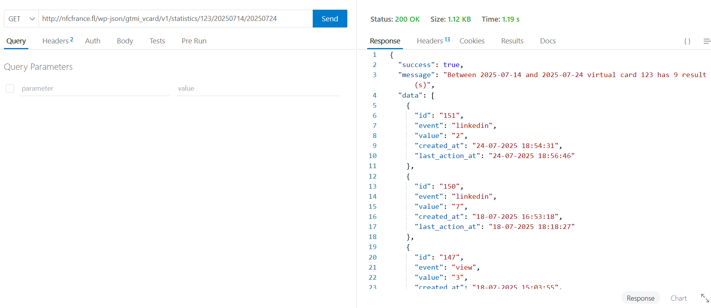
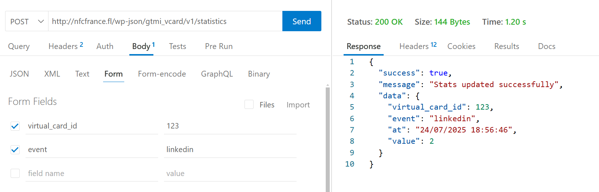

# Documentation plugin gtmi_vcard

Plugin dédié à la création des cartes virtuelles, l'association des prospects et les statistiques(vue, clics) de celles-ci.

## Installation

1. Ajouter et activer les plugins [WooCommerce et ACF](#plugins-à-installer-obligatoirement-dépendances-de-ce-module)
2. Ajouter et activer ce plugin
3. Modifier les réglages pour les permaliens, choisissez "**Titre de la publication**".Le réglage des permaliens impacte directement les routes d'API ou des pages définies par ce plugin, si les routes du site ont une autre valeur que Titre de la publication, il faut effectuer une modification de toutes les routes définis dans ce plugin.
4. Importer les 3 groupes ACF :
- [Virtual Card](#groupe-acf-custom-post-type-virtual_card)
- [Lead](#groupe-acf-custom-post-type-lead)
- [Statistics](#groupe-acf-custom-post-type-statistics)
5. Avoir au moins un produit dans le catalogue


## Environnement

- WordPress (WP) >= 6.*
- PHP >= 8.*

---

## Intégration du plugin

- A chaque commande, un *custom post type* ***virtual card*** (un *post* de type *virtual card*) est crée.
- A chaque visite de la page de la virtuelle carte, une statistique est créée ou incrémentée d'une unité avec l'événement nommée *view* à la date du jour, cf. [groupe ACF statistics](#groupe-acf-custom-post-type-statistics)
- Pour les actions ou événements (clique sur les boutons linkedin, whatsApp), c'est le même comportement, cf. [la dernière route API sur les statistiques POST /wp-json/gtmi_vcard/v1/statistics](#routes-api-statistics)
- **Page de de la carte virtuelle pour le public à styliser se trouve dans [/templates/single-virtual_card.php](./templates/single-virtual_card.php)** 

## Releases

### V1 : fonctionnalités dédiées à l'admin (BO WP)

- [x] Traitement d'une commande de carte virtuelle côté admin WP
- [x] Gestion des informations de la vcard côté admin WP
- [x] Un lead échange ses informations avec le propriétaire de la carte virtuelle depuis la page de la carte virtuelle
- [x] Export leads et virtual cards côté admin WP

#### V1.2.3

- [x] Modification des informations de ma vcard
- [x] Statistiques sans demande de consentement
- [x] API

---

### Plugins à installer obligatoirement (dépendances de ce module)

- [x] [WooCommerce](https://wordpress.org/plugins/woocommerce/) : création d'une vcard à la création d'une commande
- [x] [ACF](https://fr.wordpress.org/plugins/advanced-custom-fields/) : les groupes des champs associées aux Custom Post Type ***virtual_card, lead et statistics***

---

## Routes pour l'API pour le Front

- La règle est la suivante : **les noms champs des formulaires (attribut name) doivent avoir exactement le même nom que le champ ACF associé**

### Routes API Virtual card

- [x] `POST /wp-json/gtmi_vcard/v1/vcard/[VIRTUAL_CARD_ID]`
- Pour modifier les informations de la virtual card
- Aucun champ est obligatoire dans le body (formulaire)
- *[VIRTUAL_CARD_ID]* à remplacer par l'identifiant du *Custom Post Type "virtual_card"*



---

### Routes API Leads

- [x] `GET /wp-json/gtmi_vcard/v1/leads/[VIRTUAL_CARD_ID]`
- Pour récupérer tous les leads d'une virtual card
- Avec *[ID_VIRTUAL_CARD]* à remplacer par l'identifiant de la virtual card



---

- [x] `POST /wp-json/gtmi_vcard/v1/lead`
- Pour ajouter un lead à une virtual card
- Fournir les informations illustrées ci-après dans l'image en respectant les noms des champs pour le formulaire HTML



---

### Routes API Statistics

- [x] GET /wp-json/gtmi_vcard/v1/statistics/[VIRTUAL_CARD_ID]/[START_DATE]/[END_DATE]
- Récupérer les statistiques entre 2 dates
- Bien respecter l'ordre, d'abord la date de début (la plus éloigné) et la date de fin (la plus proche)
- Les dates sont aux formats *yyyymmdd*
- *[VIRTUAL_CARD_ID]* identifiant de la virtual card
- *[START_DATE]* date de début, la plus ancienne au format *yyyymmdd*
- *[END_DATE]* date de fin, la plus récente au format *yyyymmdd*



---

- [x] GET /wp-json/gtmi_vcard/v1/statistics/[VIRTUAL_CARD_ID]
- Récupérer tous les statistiques d'un client à partir de l'identifiant de sa virtual card
- *[VIRTUAL_CARD_ID]* identifiant de virtual card
- Informations retournées par le serveur
- Similaire à la route précédente sans les dates

```json
{
  "success": true,
  "message": "statistics of virtual card 123",
  "data": [
    {
      "id": "150",
      "event": "linkedin",
      "value": "7",
      "created_at": "18-07-2025 16:53:18",
      "last_action_at": "18-07-2025 18:18:27"
    },
    {
      "id": "147",
      "event": "view",
      "value": "3",
      "created_at": "18-07-2025 15:03:55",
      "last_action_at": "18-07-2025 18:40:22"
    },
    {
      "id": "140",
      "event": "facebook",
      "value": "1",
      "created_at": "17-07-2025 20:17:08",
      "last_action_at": "17-07-2025 20:17:08"
    }
    ...
  ]
}
```
---

- [x] POST /wp-json/gtmi_vcard/v1/statistics
- Transmettre via le formulaire HTML un champ input avec le name *virtual_card_id* l'identifiant de la virtual card et un input avec un name *event* avec la valeur de l'événement. Les événements peuvent correspondres à des cliques sur les boutons facebook, whatsapp, linkedin, contact, etc.



---

## Groupe ACF Custom Post Type virtual_card

- [Export JSON groupe ACF virtual card](./docs/acf/virtual_card.v3.json)

---

## Groupe ACF Custom Post Type lead

- [Export JSON groupe ACF lead](./docs/acf/lead.v3.json)

---

## Groupe ACF Custom Post Type statistics

- [Export JSON groupe ACF stastistics](./docs/acf/statistics.v1.json)

---

## Exports via l'admin de WP

### Exemple d'export des cartes virtuelles qui doivent être fabriquées

- [Fichier à télécharger](./docs/exports/virtual_card_export_2025-07-11-10-15-30.csv)

### Exemple d'export de tous les leads

- [Fichier à télécharger](./docs/exports/leads_export_2025-07-11-10-16-30.csv)
